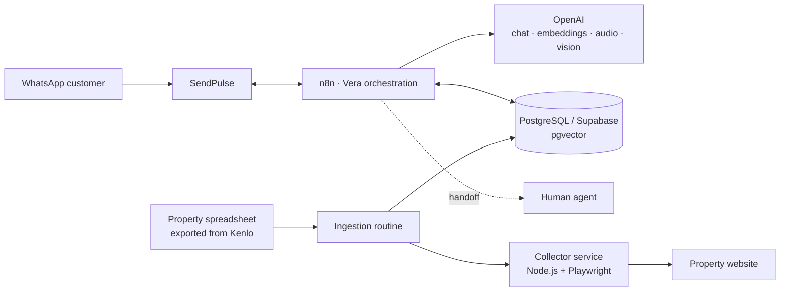

# Vera — Real Estate Assistant on WhatsApp

A real estate chatbot built to run on WhatsApp via **SendPulse**, orchestrated with **n8n**, with AI-generated answers drawn from a property database kept up to date in real time.

"Vera" qualifies leads, answers questions about specific properties using semantic search (RAG), identifies which paid ad a lead came from, and hands the conversation off to a human agent when needed.

## Overview

The system is split into three parts:

- **Conversation orchestration (n8n)** — receives WhatsApp events via SendPulse, normalizes incoming messages (text, audio, image, document), queries the property database with RAG, calls OpenAI to generate the reply, and decides whether to answer automatically or route to an agent.
- **Knowledge base (PostgreSQL/Supabase + pgvector)** — stores leads, conversation history, logs, and properties with embeddings for semantic search.
- **Property collector service (Node.js + Playwright)** — a standalone microservice, included in this repository, that visits each property's public page and extracts structured data (price, features, photos, description) to keep the database current.

## Architecture



## Features

- **AI-driven conversation**, keeping context and history per lead.
- **Semantic search (RAG)** over property descriptions, with a fallback to exact code lookup.
- **Ad attribution**: recognizes when a contact comes from a Meta/Facebook ad and links the lead to the advertised property.
- **Media processing**: audio transcription, image analysis, and handling of documents sent by the customer.
- **Human handoff**, with logging and release/return of the lead to the AI once the human conversation ends.
- **Message debouncing**: batches messages sent in quick succession before generating a single reply.
- **Automatic property ingestion**: periodically reads a spreadsheet exported from Kenlo, collects each property's data, and updates the vector database.
- **Centralized error pipeline**, normalizing and logging failures from any point in the flow.

## Stack

| Layer | Technology |
|---|---|
| Orchestration | n8n |
| Messaging | SendPulse (WhatsApp Business API) |
| AI | OpenAI (chat, embeddings, transcription, vision) |
| Data | PostgreSQL / Supabase (pgvector) |
| Property catalog | Google Sheets |
| Data collection | Node.js, Express, Playwright |

## Property collector service

Included in this repository under [`collector-service/`](collector-service) — the only part with full source code, since it holds no chatbot business logic.

It exposes a simple HTTP API, authenticated with an API key, that n8n calls whenever it needs to (re)collect a property's data:

- `POST /coletar-imovel` — takes a property code and returns the data extracted from the corresponding public page.
- `GET /health` — service status (browser connected, queue size, etc).

Engineering highlights:

- **Bounded queue** so concurrent collections don't overload the browser.
- **Preventive Chromium recycling** after N collections, avoiding memory leaks on long-running instances.
- **Total timeout per collection** and **automatic retry** on transient failures.
- Blocks images/fonts/media during navigation to speed up collection.
- Extraction via `JSON-LD` (Schema.org `Product`/`RealEstateListing`) combined with parsing the page's feature blocks.

```bash
cd collector-service
npm install
cp .env.example .env   # fill in COLLECTOR_API_KEY and SITE_BASE_URL
npm start
```

## What's not in this repository

This project was built for a real client, so the following is intentionally **not published**:

- The full n8n workflow (145 nodes) — it contains business rules, prompts, and table names specific to the client.
- The AI agent's prompts.
- Credentials, tokens, and URLs specific to the site/company served.
- Real lead and conversation data.

The goal of this repository is to document the architecture and, through the collector service, demonstrate the quality of the engineering behind the project.

## Author

Built by João Vitor Carvalho — [@JoaoVitorCarvalhoPR](https://github.com/JoaoVitorCarvalhoPR).
