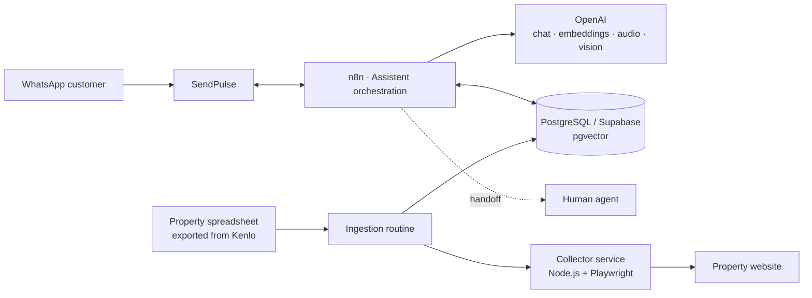
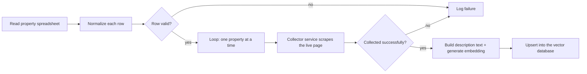

# Real Estate Assistant on WhatsApp

A real estate chatbot built to run on WhatsApp via **SendPulse**, orchestrated with **n8n**, with AI-generated answers drawn from a property database kept up to date in real time.

It qualifies leads, answers questions about specific properties using semantic search (RAG), identifies which paid ad a lead came from, and hands the conversation off to a human agent when needed.

## Overview

The system is split into three parts:

- **Conversation orchestration (n8n)** — receives WhatsApp events via SendPulse, normalizes incoming messages (text, audio, image, document), queries the property database with RAG, calls OpenAI to generate the reply, and decides whether to answer automatically or route to an agent.
- **Knowledge base (PostgreSQL/Supabase + pgvector)** — stores leads, conversation history, logs, and properties with embeddings for semantic search.
- **Property collector service (Node.js + Playwright)** — a standalone microservice, included in this repository, that visits each property's public page and extracts structured data (price, features, photos, description) to keep the database current.

## Architecture



## n8n workflow breakdown

The n8n workflow itself (145 nodes, not published) is really two independent flows sharing the same database: a **real-time conversational flow** triggered by every WhatsApp event, and a **catalog ingestion flow** that keeps the property database in sync with the source site. Below is a simplified, region-by-region view of each.

### Conversational flow

```mermaid
flowchart TD
    subgraph R1["1 · Inbound & normalization"]
        direction TB
        r1a[SendPulse webhook] --> r1b[Classify event type] --> r1c{Valid event?}
    end

    subgraph R2["2 · Media processing"]
        direction TB
        r2a{Has media?} --> r2b[Detect type: audio / image / document / video]
        r2b --> r2c[Transcribe · analyze · adapt]
        r2c --> r2d[Consolidate into one message]
    end

    subgraph R3["3 · Lead & debounce"]
        direction TB
        r3a[Upsert lead] --> r3b[Buffer rapid-fire messages]
        r3b --> r3c{Still the latest message?}
    end

    subgraph R4["4 · Ad attribution"]
        direction TB
        r4a{From a Meta ad referral?} -->|yes| r4b[Extract / resolve advertised property]
        r4b --> r4c{Confident match?}
        r4c -->|yes| r4d[Learn ad → property link]
        r4c -->|no| r4e[Ask for more detail or hand off]
    end

    subgraph R5["5 · Property resolution"]
        direction TB
        r5a{Message references a property?} -->|by code| r5b[Exact lookup]
        r5a -->|ambiguous| r5c[Ask to disambiguate]
        r5b --> r5d[Refresh from live site if stale]
    end

    subgraph R6["6 · RAG + LLM response"]
        direction TB
        r6a[Load conversation history] --> r6b[Embed message]
        r6b --> r6c[Semantic search over properties]
        r6c --> r6d[OpenAI chat completion]
        r6d --> r6e[Validate & parse structured reply]
    end

    subgraph R7["7 · Delivery"]
        direction TB
        r7a[Send reply via SendPulse] --> r7b{Needs human handoff?}
        r7b -->|yes| r7c[Tag conversation + flag for an agent]
    end

    subgraph R8["8 · Human handoff"]
        direction TB
        r8a[Agent claims the lead] --> r8b[Log agent messages]
        r8b --> r8c{Conversation closed?}
        r8c -->|yes| r8d[Clear flags, return lead to the AI]
    end

    ERR[["Cross-cutting: centralized error normalization & logging"]]

    R1 --> R2 --> R3 --> R4 --> R5 --> R6 --> R7 --> R8
    R1 -.-> ERR
    R2 -.-> ERR
    R6 -.-> ERR
    R7 -.-> ERR
```



- **Inbound & normalization** — the single global webhook receives every SendPulse event and filters out anything that isn't an actionable incoming message.
- **Media processing** — audio is transcribed, images are analyzed with vision, documents/videos get a lightweight placeholder — everything collapses into one normalized text message.
- **Lead & debounce** — messages sent in quick succession are buffered so the AI replies once per "burst" instead of once per message.
- **Ad attribution** — when a lead's first contact carries a Meta ad referral, the flow tries to resolve which property was advertised, requiring an exact match before it trusts the link; ambiguous cases fall back to asking the lead or handing off.
- **Property resolution** — figures out which property (if any) the current message is about, by code or by conversation context, and triggers a fresh scrape via the collector service when the cached data is stale.
- **RAG + LLM response** — retrieves chat history and the most relevant properties via vector search, then asks the LLM to produce a structured reply.
- **Delivery** — sends the reply back through SendPulse and flags the conversation for a human agent when the AI decides it should.
- **Human handoff** — once an agent takes over, their messages are logged separately; closing the case clears the handoff flags and returns the lead to the AI.
- **Error pipeline** — every branch reports failures to a single normalization/logging point, so nothing fails silently.

### Catalog ingestion flow



Run manually or on a schedule: a spreadsheet exported from Kenlo is the source of truth for which properties should exist, the collector service fetches each one's live page, and successful results are embedded and upserted into Supabase. Rows that fail to collect are logged instead of silently dropped. A separate step (currently disabled by default) can deactivate properties that disappear from the spreadsheet.

## Features

- **AI-driven conversation**, keeping context and history per lead.
- **Semantic search (RAG)** over property descriptions, with a fallback to exact code lookup.
- **Ad attribution**: recognizes when a contact comes from a Meta/Facebook ad and links the lead to the advertised property.
- **Media processing**: audio transcription, image analysis, and handling of documents sent by the customer.
- **Human handoff**, with logging and release/return of the lead to the AI once the human conversation ends.
- **Message debouncing**: batches messages sent in quick succession before generating a single reply.
- **Automatic property ingestion**: periodically reads a spreadsheet exported from Kenlo, collects each property's data, and updates the vector database.
- **Centralized error pipeline**, normalizing and logging failures from any point in the flow.

## Stack

| Layer | Technology |
|---|---|
| Orchestration | n8n |
| Messaging | SendPulse (WhatsApp Business API) |
| AI | OpenAI (chat, embeddings, transcription, vision) |
| Data | PostgreSQL / Supabase (pgvector) |
| Property catalog | Google Sheets |
| Data collection | Node.js, Express, Playwright |

## Property collector service

Included in this repository under [`collector-service/`](collector-service) — the only part with full source code, since it holds no chatbot business logic.

It exposes a simple HTTP API, authenticated with an API key, that n8n calls whenever it needs to (re)collect a property's data:

- `POST /coletar-imovel` — takes a property code and returns the data extracted from the corresponding public page.
- `GET /health` — service status (browser connected, queue size, etc).

Engineering highlights:

- **Bounded queue** so concurrent collections don't overload the browser.
- **Preventive Chromium recycling** after N collections, avoiding memory leaks on long-running instances.
- **Total timeout per collection** and **automatic retry** on transient failures.
- Blocks images/fonts/media during navigation to speed up collection.
- Extraction via `JSON-LD` (Schema.org `Product`/`RealEstateListing`) combined with parsing the page's feature blocks.

```bash
cd collector-service
npm install
cp .env.example .env   # fill in COLLECTOR_API_KEY and SITE_BASE_URL
npm start
```

## What's not in this repository

This project was built for a real client, so the following is intentionally **not published**:

- The full n8n workflow (145 nodes) — it contains business rules, prompts, and table names specific to the client.
- The AI agent's prompts.
- Credentials, tokens, and URLs specific to the site/company served.
- Real lead and conversation data.

The goal of this repository is to document the architecture and, through the collector service, demonstrate the quality of the engineering behind the project.

## Author

Built by João Vitor Carvalho — [@JoaoVitorCarvalhoPR](https://github.com/JoaoVitorCarvalhoPR).
