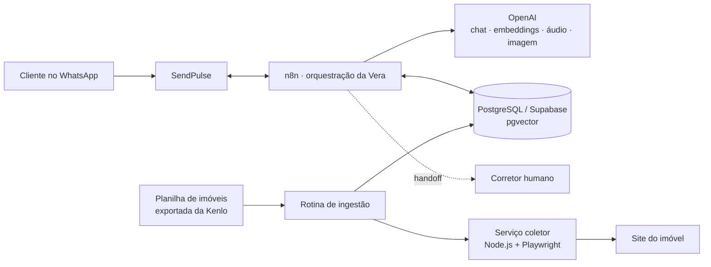

# Vera — Assistente de Imóveis via WhatsApp

Chatbot de atendimento imobiliário construído para operar no WhatsApp via **SendPulse**, orquestrado em **n8n**, com respostas geradas por IA a partir de uma base de imóveis mantida em tempo real.

A "Vera" qualifica leads, responde dúvidas sobre imóveis específicos usando busca semântica (RAG), identifica de qual anúncio pago o lead veio e transfere a conversa para um corretor humano quando necessário.

## Visão geral

O sistema é dividido em três partes:

- **Orquestração conversacional (n8n)** — recebe eventos do WhatsApp via SendPulse, normaliza mensagens (texto, áudio, imagem, documento), consulta a base de imóveis com RAG, chama a OpenAI para gerar a resposta e decide entre responder automaticamente ou acionar um corretor.
- **Base de conhecimento (PostgreSQL/Supabase + pgvector)** — armazena leads, histórico de conversas, logs e os imóveis com embeddings para busca semântica.
- **Serviço coletor de imóveis (Node.js + Playwright)** — um microserviço próprio, incluído neste repositório, que visita as páginas públicas dos imóveis e extrai os dados estruturados (preço, características, fotos, descrição) para manter a base sempre atualizada.

## Arquitetura



## Funcionalidades

- **Atendimento conversacional com IA**, mantendo contexto e histórico por lead.
- **Busca semântica (RAG)** sobre a descrição dos imóveis, com fallback para busca por código exato.
- **Atribuição de origem**: reconhece quando o contato vem de um anúncio do Meta/Facebook e associa o lead ao imóvel anunciado.
- **Processamento de mídia**: transcrição de áudio, análise de imagem e tratamento de documentos enviados pelo cliente.
- **Handoff para atendimento humano**, com registro de logs e liberação/retorno do lead para a IA ao final do atendimento.
- **Debounce de mensagens**: agrupa mensagens enviadas em sequência rápida antes de gerar uma resposta.
- **Ingestão automática de imóveis**: leitura periódica de uma planilha exportada da Kenlo, coleta dos dados de cada imóvel e atualização da base vetorial.
- **Pipeline de erros centralizado**, com normalização e log de falhas em qualquer ponto do fluxo.

## Stack

| Camada | Tecnologia |
|---|---|
| Orquestração | n8n |
| Mensageria | SendPulse (WhatsApp Business API) |
| IA | OpenAI (chat, embeddings, transcrição, visão) |
| Dados | PostgreSQL / Supabase (pgvector) |
| Catálogo de imóveis | Google Sheets |
| Coleta de dados | Node.js, Express, Playwright |

## Serviço coletor de imóveis

Está incluído neste repositório em [`collector-service/`](collector-service) — é a única parte com código-fonte completo, por não conter regras de negócio do chatbot.

Expõe uma API HTTP simples, autenticada por API key, que o n8n chama sempre que precisa (re)coletar os dados de um imóvel:

- `POST /coletar-imovel` — recebe um código de imóvel e retorna os dados extraídos da página pública correspondente.
- `GET /health` — status do serviço (navegador ativo, tamanho da fila, etc).

Características de engenharia:

- **Fila com limite** para não sobrecarregar o navegador com coletas simultâneas.
- **Reciclagem preventiva do Chromium** após N coletas, evitando vazamento de memória em execuções longas.
- **Timeout total por coleta** e **retry automático** em falhas transitórias.
- Bloqueio de imagens/fontes/mídia na navegação para acelerar a coleta.
- Extração via `JSON-LD` (Schema.org `Product`/`RealEstateListing`) combinada com leitura dos blocos de características da página.

```bash
cd collector-service
npm install
cp .env.example .env   # preencha COLLECTOR_API_KEY e SITE_BASE_URL
npm start
```

## O que não está neste repositório

Este projeto foi desenvolvido para um cliente real, então propositalmente **não estão publicados**:

- O workflow completo do n8n (145 nós) — contém regras de negócio, prompts e nomes de tabelas específicos do cliente.
- Prompts do agente de IA.
- Credenciais, tokens e URLs específicas do site/empresa atendida.
- Dados de leads e conversas reais.

O objetivo deste repositório é documentar a arquitetura e demonstrar, através do serviço coletor, a qualidade do código de engenharia por trás do projeto.

## Autor

Desenvolvido por [seu nome] — [link do GitHub/LinkedIn].
